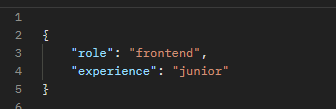
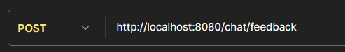

# GT-TrainingInterview-Back

## Goal

- With this application, both UX/UI designers like backend and frontend developers will be able to practice job interviews that will help them improve their skills and confidence in the hiring process.

## Description
- This is the repository for the backend for the interview training application.

## Technologies Used
- **Java**: The primary programming language used for development.
- **Spring**: A framework used to build the backend services.

## Contributions
- If you want to contribute, please create a new branch and submit a *pull request*.
---
## EndPoints
- **Post** (*/chat/ask*)
    - 
    - Include the data in the POST request:
      - "role" (UX/UI designer, frontend, backend)
      - "experience" (trainer, junior, semi-senior, senior, lead)
    - Get the question
    - Example:
        - 
        - 
- **Post** (*/chat/feedback*)
  - 
  - Enter your response to receive feedback
  - Example:
    - 
    - 
